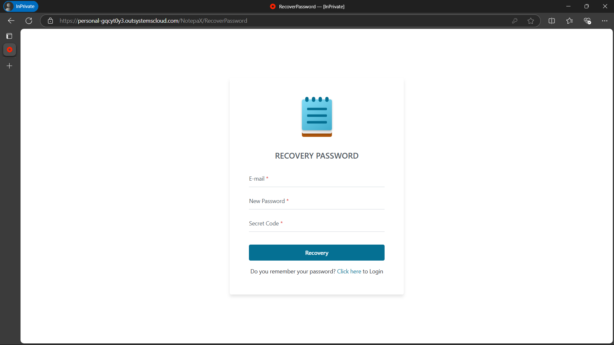
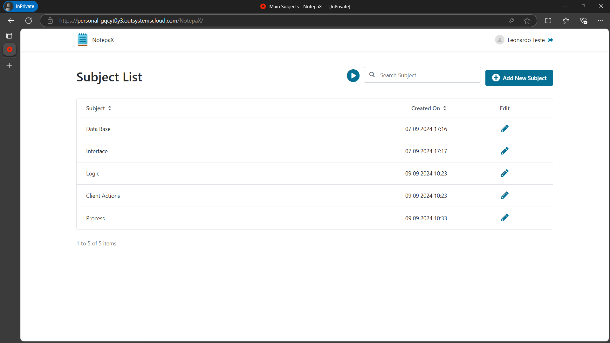
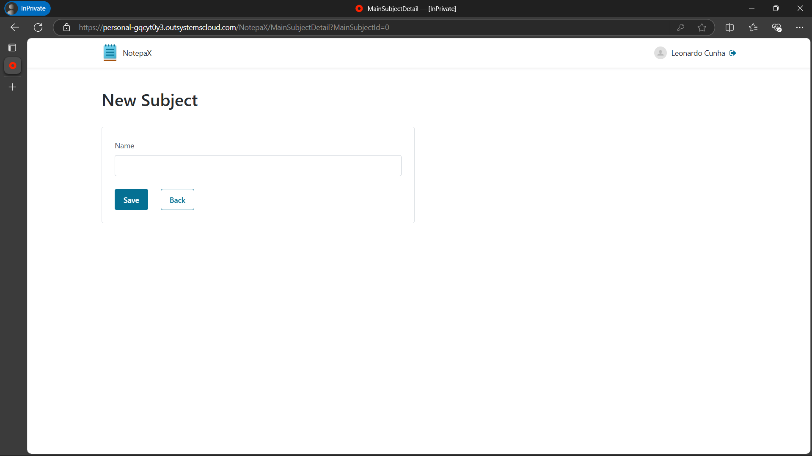
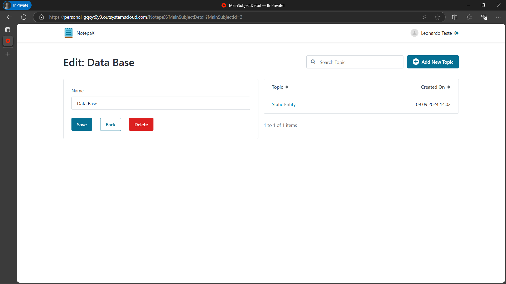
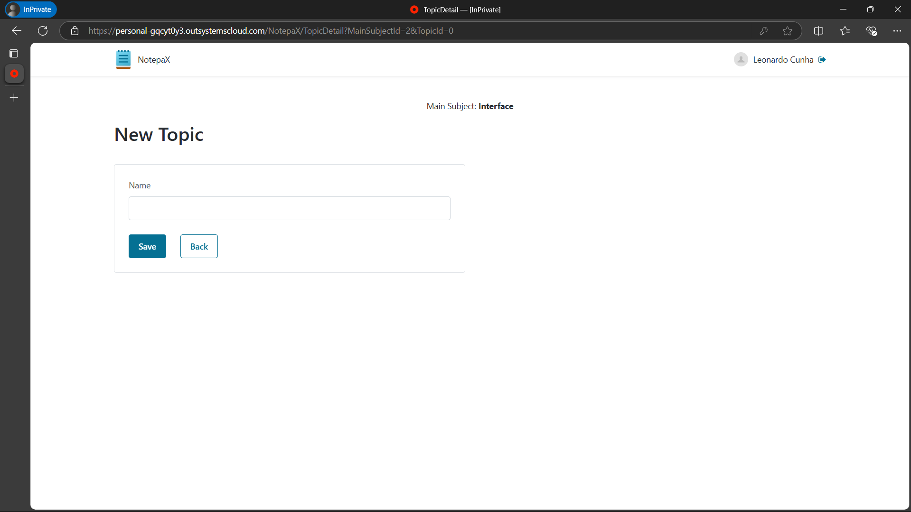
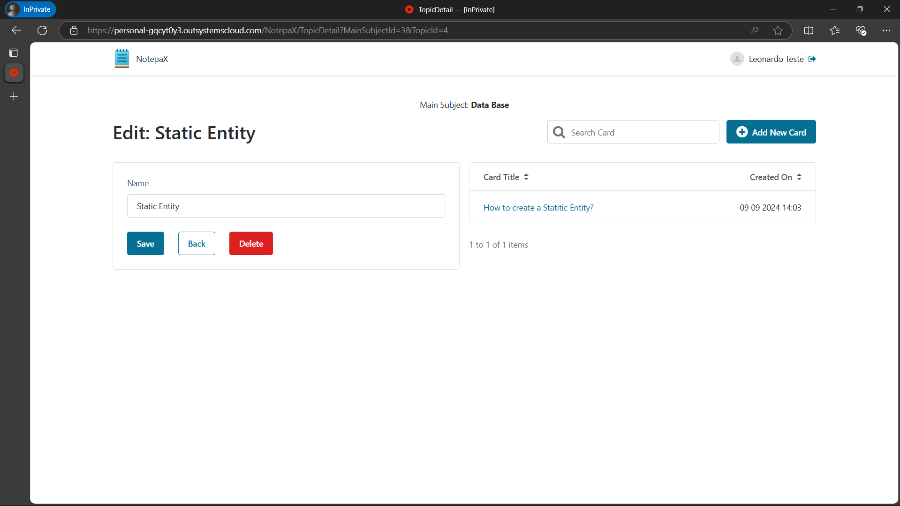
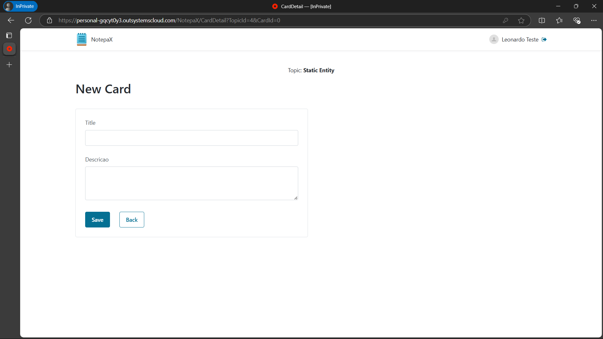
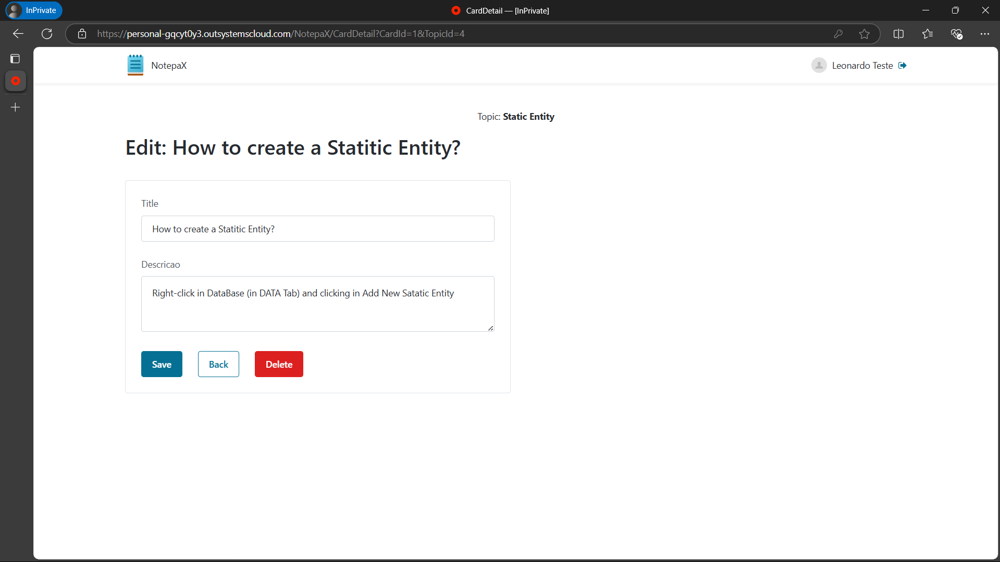

# NotepaX - Sistema de Flashcards para Estudos

## 1. Introdução

O NotepaX é um sistema de flashcards desenvolvido na plataforma **OutSystems Reactive**, com o objetivo de auxiliar no processo de estudo e fixação de conteúdos de aprendizagem. Este projeto foi desenvolvido como parte prática do **módulo de Introdução ao OutSystems** da **Academia RafaOutSystems Expert**, consolidando os conceitos fundamentais da plataforma em um projeto prático e funcional.

## 2. Objetivos do Projeto

- Aplicar os conceitos básicos do OutSystems para criar uma aplicação que auxilie no estudo de forma interativa.
- Desenvolver um sistema de gerenciamento de cards, implementando as funcionalidades de **CRUD** (Create, Read, Update, Delete) para tópicos e flashcards.
- Implementar um sistema de revisão de flashcards, utilizando técnicas de repetição espaçada para melhorar a retenção de conhecimento.

## 3. Funcionalidades do Projeto

- **Cadastro e Gerenciamento de Tópicos:** Criar, editar e excluir tópicos para organizar os conteúdos de estudo.
- **Cadastro e Gerenciamento de Cards:** Adicionar, editar e excluir cards dentro dos tópicos, permitindo a construção de perguntas e respostas.
- **Sistema de Revisão de Cards:** Implementar a técnica de repetição espaçada, permitindo ao usuário revisar os cards de maneira eficiente até que todas as respostas sejam acertadas.
- **Botão de Reset e Função de Review:** A opção de resetar o baralho de cards ao final da revisão, permitindo recomeçar o ciclo de estudo do zero.

## 4. Tecnologias e Ferramentas Utilizadas

- **OutSystems Reactive:** Para o desenvolvimento da aplicação e lógica de negócios.
- **Server Actions e Client Actions:** Utilizadas para implementar o CRUD e a lógica de revisão dos cards.
- **Banco de Dados Interno do OutSystems:** Gerenciamento dos dados relacionados a usuários, tópicos e cards.

## 5. Estrutura do Banco de Dados

O banco de dados foi modelado de acordo com os conceitos introdutórios do OutSystems:

- **Tabela MainSubject**(Assunto Principal)
- **Tabela Topic**(Tópico do Card)
- **Tabela Card**(Detalhes do Card)
- **Tabela User_Extension e User**(Para o gerenciamento de usuários e recuperação de senha)

## 6. Estrutura de Telas e Navegação

- **Telas de Login:** Utiliza a tabela padrão User do OutSystems, com a funcionalidade de recuperação de senha usando um código secreto.

Login

- Login
  

- Recovery Password
  

- User Register
  
  
- **Tela Principal:** Apresenta os assuntos principais, possibilitando a navegação para os tópicos e cards.

Subject Login

- Subject List(Lista de Assunto Principal):
  

- New Subject List:
  

- Edit Subject List:
  

- **Tela de Tópicos e Cards:** Permite adicionar, editar e excluir tópicos e cards, seguindo as práticas de CRUD.

Topic

- New topic
  - Topic(Criação de Tópicos a partir da Subject List Edit):

  

- Edit Topic
  

Card

- New Card
  

- Edit Card
  

- **Tela de Revisão de Cards:** Exibe os flashcards para o usuário indicar se acertou ou errou, proporcionando uma revisão interativa e prática.

Review

- Starting Review
  

- Main Review
  

- Ongoing review
  

- Review Completed
  
  
## 7. Lógica de Negócio Implementada

- **CRUD Completo:** Implementação completa para todas as entidades do projeto (Assunto Principal, Tópico e Card), seguindo os princípios básicos do OutSystems.
- **Repetição Espaçada:** O sistema revisa os cards que o usuário marcou como incorretos até que sejam acertados, garantindo a retenção do conteúdo.
- **Validações:** Implementadas para assegurar que os dados inseridos pelo usuário são válidos e completos.

  

## 8. Principais Server Actions e Client Actions

- **User_Create e User_Recovery:** Ações que gerenciam o cadastro e a recuperação de senha de usuários.

  
  
- **MainSubject_CreateOrUpdate e MainSubject_Delete:** Manipulam a criação, atualização e exclusão de Assuntos Principais.

  
  
- **Topic_CreateOrUpdate e Topic_Delete:** Realizam as operações de CRUD para os Tópicos.

  
  
- **Card_CreateOrUpdate e Card_Delete:** Gerenciam as operações de CRUD para os Cards.

  
  
- **Get_NextCard:** Responsável por recuperar o próximo card na sequência de revisão.

  

## 9. Processos de Revisão e Resolução de Cards

O processo de revisão é a funcionalidade central do NotepaX:

- Ao acessar a revisão, o usuário visualiza o título do card e, ao virar, a resposta correta.
- O usuário marca se acertou ou errou; cards incorretos voltam ao ciclo até que sejam acertados.
- Uma vez que todos os cards são revisados corretamente, o processo de revisão é concluído, e o usuário pode reiniciá-lo com o botão de reset.

Review

- Starting Review
  

- Main Review
  

- Ongoing review
  

- Review Completed
  

## 10. Recursos Adicionais

- **Botão Play/Refresh:** Inicia o processo de revisão dos cards e permite resetar para revisar novamente após a conclusão.

  
  
- **Estruturação de Navegação:** Segue as melhores práticas de navegação para garantir que o usuário possa facilmente transitar entre as telas de assuntos, tópicos e cards.

## 11. Considerações Finais

O NotepaX foi desenvolvido como um projeto prático para consolidar os conhecimentos do módulo introdutório de OutSystems, utilizando a abordagem OutSystems Reactive. O projeto demonstrou a aplicação dos fundamentos de construção de uma aplicação completa, desde a estruturação de banco de dados até a implementação de lógica e interface de usuário, fortalecendo a base de conhecimentos essenciais para o desenvolvimento low-code.

## 12. Contribua e Conecte-se

Se você gostou deste projeto, sinta-se à vontade para fazer um **Fork**, **Compartilhar**, ou deixar uma **Star**! 🟊

Assista o vídeo do projeto clicando aqui 👇😊

Confira também outros repositórios no meu [GitHub](https://github.com/cunha-leo/) e acompanhe minha jornada e atualizações profissionais no meu [LinkedIn](https://www.linkedin.com/in/leo-cunha-allves/). Vamos crescer juntos e compartilhar conhecimento!

### 🔗 Links Úteis

- [Web NotepaX](https://personal-gqcyt0y3.outsystemscloud.com/NotepaX/)
- [NotepaX GitHub](https://github.com/cunha-leo/NotepaX-OutSystems)
- [Meu GitHub](https://github.com/cunha-leo/)
- [Meu LinkedIn](https://www.linkedin.com/in/leo-cunha-allves/)
