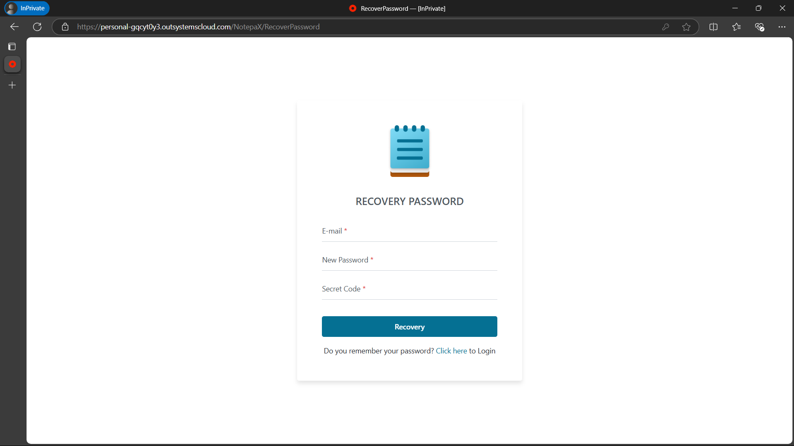
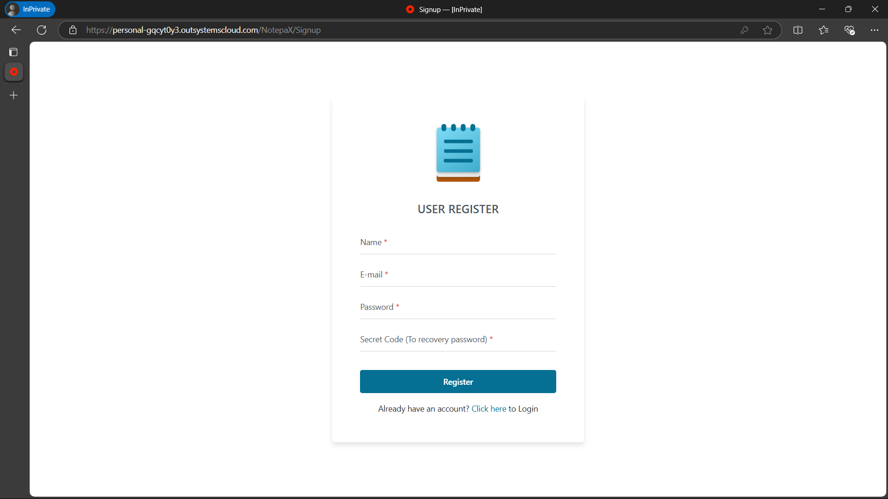
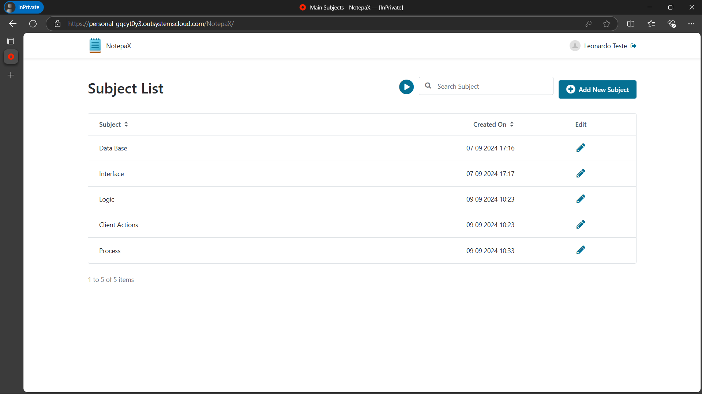
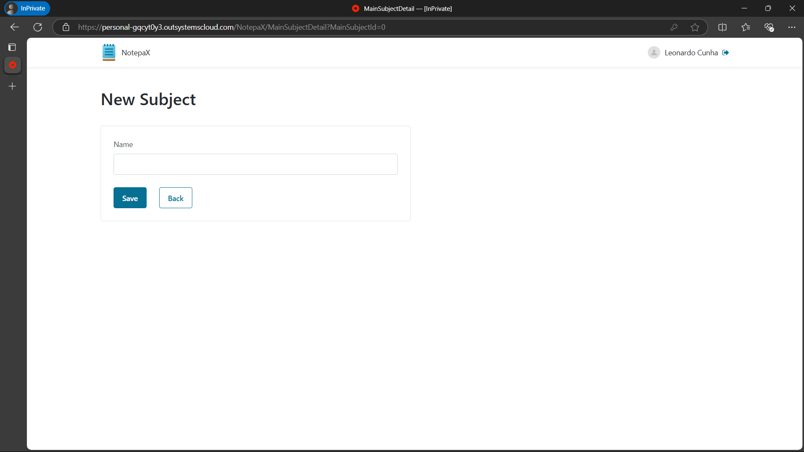
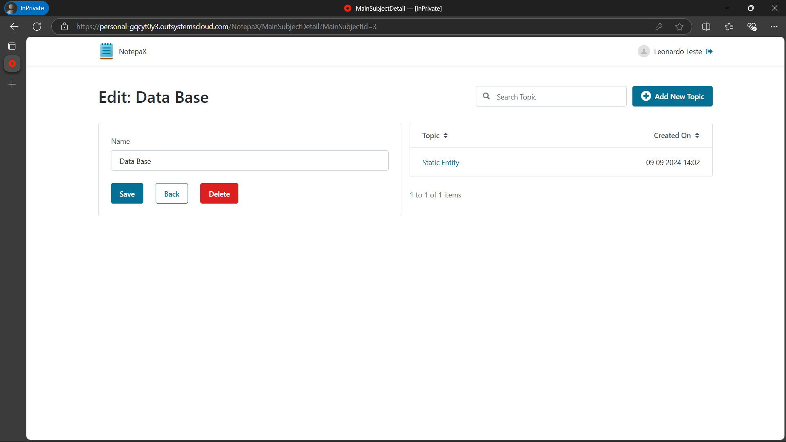
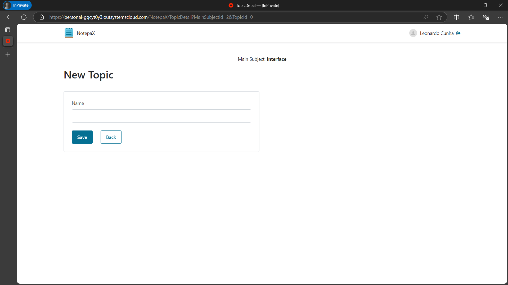
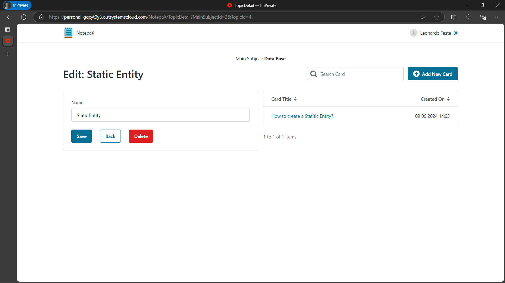
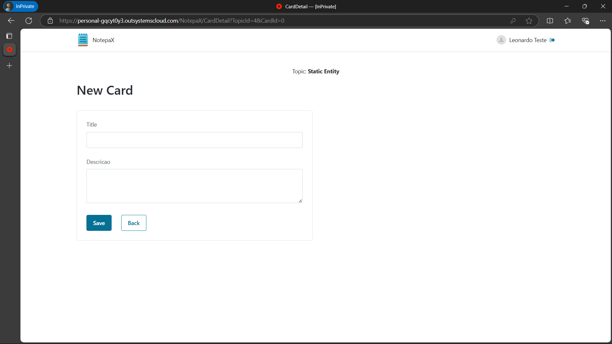
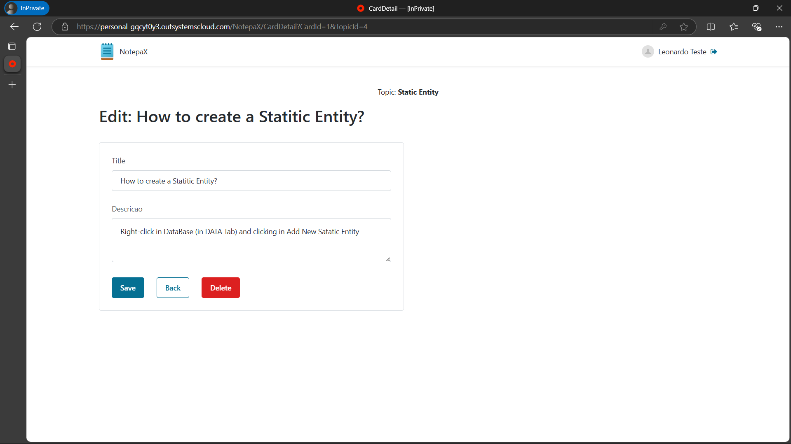

# NotepaX - Aplicación de Falshcards para Estudio

## 1. Introducción

NotepaX es un sistema de flashcards desarrollado en la plataforma **OutSystems Reactive**, con el objetivo de facilitar el proceso de estudio y la fijación de contenido de aprendizaje. Este proyecto fue desarollado como parte práctica del **módulo de Introducción a OutSystems** de la **Academia RafaOutSystems Expert**, consolidando los conceptos fundamentales de la plataforma en un proyecto prático y funcional.

## 2. Objetivos del Proyecto

- Aplicar los conceptos básicos de OutSystems para crear una apliacación que facilite el estudio de forma interactiva.
- Desarrollar un sistema de gestión de tarjetas, implementando las funcionalidades de **CRUD** (Create, Read, Update, Delete) para temas y flashcards.
- Implementar un sistema de revisión de flashcards, utilizando técnicas de repetición espaciada para mejorar la retención del conocimento.

## 3. Funcionalidades del Proyecto

- **Registro y Gestión de Temas:** Crear, editar y eliminar temas para organizar los contenidos de estudio.
- **Registro y Gestión de Tarjeta:** Añadir, editar y eliminar trajetas dentro de los temas, permitiendo la construcción de preguntas y respuetas.
- **Sistema de Revisón de Tarjetas:** Implementar la técnica de repetición espaciada, permitindo al usuario revisar las tarjetas de manera eficiente hasta que todas las respuestas sean correctas.
- **Botón de Reinicio y Función de Revisión:** La opción de reiniciar el mazo de tarjetas al final de la revisión, permitiendo comenzar el ciclo de estudio desde cero.

## 4. Tecnologías y Herramientas Utilizadas

- **OutSystems Reactive:** Para el desarrollo de la apalicación y la lógica de negocio.
- **Server Actions y Client Actions:** Utilizadas para implementar el CRUD y la lógica de revisión de las tarjetas.
- **Base de Datos Interna de OutSystems:** Gestión de los datos realacionados con usuarios, temas y tarjetas.

## 5. Estructura de la Base de Datos

La base de datos fue modelada de acuerdo con los conceptos introductorios de OutSystems:

- **Tabla MainSubject**(Asunto Principal)
- **Tabla Topic**(Tema de la Tarjeta)
- **Tabla Card**(Detalhes de la Tarjeta)
- **Tabla User_Extension y User**(Para la gestión de usuarios y recuperación de contraseña)

## 6. Estructura de Pantallas y Navegación

- **Pantallas de Login:** Utiliza la tabla estándar User de OutSystems, con la funcionalidad de recuperación de contraseña mediante un código secreto.

Login

- Login
  

- Recovery Password
  

- User Register
  
  
- **Pantalla Principal:** Presenta los temas principales, permitiendo la navegación hacia los tópicos y tarjetas.

Subject List

- Subject List(Lista de Temas principales):
  

- New Subject List:
  

- Edit Subject List:
  

- **Pantalla de Tópicos y Tarjetas:** Permite agregar, editar y elimar tópicos y tarjetas, siguiendo las prácticas de CRUD.

Topic

- New topic
  - Topic(Creación de Tópicos a partir de la Lista de Temas Editada):

  

- Edit Topic
  

Card

- New Card
  

- Edit Card
  

- **Pantalla de Revisión de Tarjetas:** Muestra las tarjetas al usuario para indicar si respondió correctamente o no, proporcionando una revisión interactiva y prática.

Review

- Starting Review
  

- Main Review
  

- Ongoing review
  

- Review Completed
  
  
## 7. Lógica de Negocio Implementada

- **CRUD Completo:** Implementación completa para toda las entidades del proyecto (Tema Principal, Tópico y Tarjeta), siguiendo los principios básicos de OutSystems.
- **Repetición Espaciada:** El sistema revisa las tarjetas que el usuario marcó como incorrectas hasta que sean respondidas correctamente, garantizando la reteción del contenido.
- **Validaciones:** Implementadas para asegurar que los datos ingresados por el usuario sean válidos y completos.

  

## 8. Principales Server Actions e Client Actions

- **User_Create y User_Recovery:** Acciones que gestionan el registro y la recuperación de contraseña de los usuarios.

  
  
- **MainSubject_CreateOrUpdate y MainSubject_Delete:** Manejan la creación, actualización y eliminación de Temas Principales.

  
  
- **Topic_CreateOrUpdate y Topic_Delete:** Realizan las operaciones de CRUD para los Tópicos.

  
  
- **Card_CreateOrUpdate y Card_Delete:** Gestionan las operaciones de CRUD para las Tarjetas.

  
  
- **Get_NextCard:** Responsable de recuperar la seguiente tarjeta en la secuencia de revisión.

  

## 9. Procesos de Revisión y Rezolución de Tarjetas

El proceso de revisión es la funcionalidad central de NotepaX:

- Al acceder a la revisión, el usuario visualiza el título de la tarjeta y, al voltearla la respuesta correcta.
- El usuario indica si su respuesta fue correcta o incorrecta; las tarjetas incorrectas vuelven al ciclo hasta que sean respondidas correctamente.
- Una vez que todas las tarjetas han sido revisadas correctamente, el proceso de revisión se completa, y el usuario puede reiniciarlo con el botón de reinicio.

Review

- Starting Review
  

- Main Review
  

- Ongoing review
  

- Review Completed
  

## 10. Recursos Adicionales

- **Botón Play/Refresh:** Inicia el proceso de revisión de las tarjetas y permite reiniciarlo para revisar nuevamente después de completarlo.

  
  
- **Estructuración de Navegación:** Sigue las mejores práticas de navegación para garantizar que el usuario pueda transitar fácilmente entre las pantallas de temas, tópicos y tarjetas.

## 11. Consideraciones Finales

El NotepaX fue desarollado como un proyecto práctico para consolidar los conocimientos del módulo introductorio de OutSystems, utilizando el enfoque OutSystems Reactive. El proyecto demonstró la aplicación de los fundamentos para construir una aplicación completa, desde la estructuración de la base de datos hasta la implementación de lógica y la interfaz de usuario, fortaleciendo la base de conocimientos esenciales para el desarrollo low-code.

## 12. Contribuye y Conéctate

Si te gustó este proyecto, ¡no dudes en hacer un **Fork**, **Compartir**, o dejar una **Estrella**! 🟊

Mira el video del proyecto haciendo clic aquí 👇😊

Consulta también otros respositorios en mi [GitHub](https://github.com/cunha-leo/) y sigue mi trayectoria y actualizaciones profesionales en mi [LinkedIn](https://www.linkedin.com/in/leo-cunha-allves/). ¡Crecemos juntos y compartimos conocimiento!

### 🔗 Links Útiles

- [Web NotepaX](https://personal-gqcyt0y3.outsystemscloud.com/NotepaX/)
- [NotepaX en GitHub](https://github.com/cunha-leo/NotepaX-OutSystems)
- [Mi GitHub](https://github.com/cunha-leo/)
- [Mi LinkedIn](https://www.linkedin.com/in/leo-cunha-allves/)
